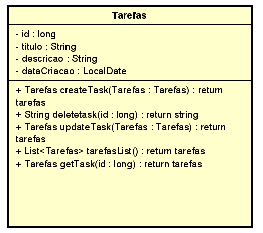

# Tarefas em dia

Essa é uma API criada em java onde voce pode anotar suas tarefas editar como quiser.

Projeto sem fins lucrativos. É apenas um projetos básico para o aprendizado de dois estudantes de programação.

# Colaboradores:

André Mourão Patriarca

Matheus dos Santos Araújo


## Documentação da API

#### Atributos da entidade


| Parâmetro   | Tipo       | Descrição                           |
| :---------- | :--------- | :---------------------------------- |
| `id` | `Long` | **Obrigatório**. A chave da sua API |
| `titulo` | `String` | **Obrigatório**. nome da tarefa |
| `Descrição` | `String` | **Obrigatório**. Descrição da tarefa |
| `Status` | `status` | **Obrigatório**. Enum(em_andamento,concluido e pendente) |
| `dataCriacao` | `LocalDate` | **Obrigatório**. o dia que foi criado a api (*obs:"dd-MM-yyyy") |

#### UML




### Database


### Documentação com Spring OpenAPI


*Obs: testamos essa API no postman também 


```http
  GET - para procurar uma tarefa especifica
  http://localhost/tarefas/{id}
```

```http
  GET - para listar todas tarefas 
  http://localhost/tarefas
```
```http
  POST - para criar uma tarefa 
  http://localhost/tarefas/addTask
```

```http
  DELETE - para excluir uma tarefa 
  http://localhost/tarefas/{id}
```
```http
  PUT - para atualizar uma tarefa 
  http://localhost/tarefas/{id}
```